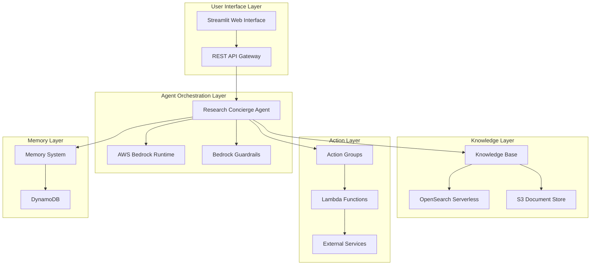

# Design Document: AI Research Concierge

## Overview

The AI Research Concierge is a cloud-native intelligent agent system built on AWS that combines Retrieval-Augmented Generation (RAG), serverless task execution, and persistent memory to help users research technical documents and automate productivity tasks. The system leverages AWS Bedrock with Claude 3.5 Sonnet as the core reasoning engine, integrated with S3 for document storage, OpenSearch Serverless for vector search, and Lambda functions for task execution.

The architecture follows a microservices pattern with clear separation between the knowledge layer (RAG), action layer (Lambda functions), memory layer (persistent context), and safety layer (Bedrock Guardrails). This design enables scalable, secure, and maintainable operation while providing transparent reasoning traces for user trust and debugging.

## Architecture

The system follows a layered architecture with the following key components:



### Component Responsibilities

- **Research Concierge Agent**: Central orchestrator that processes user requests, coordinates between knowledge retrieval and action execution
- **Knowledge Base**: RAG system that chunks, embeds, and retrieves relevant document passages
- **Action Groups**: Registry of available Lambda functions with their schemas and execution logic
- **Memory System**: Persistent storage for user preferences, conversation history, and learned patterns
- **Guardrails**: Safety layer that filters inputs/outputs and enforces security policies

## Components and Interfaces

### Research Concierge Agent

The core agent implements the main conversation loop and decision-making logic:

```python
class ResearchConciergeAgent:
    def __init__(self, bedrock_client, knowledge_base, action_groups, memory_system, guardrails):
        self.bedrock_client = bedrock_client
        self.knowledge_base = knowledge_base
        self.action_groups = action_groups
        self.memory_system = memory_system
        self.guardrails = guardrails
        self.system_prompt = self._load_system_prompt()
    
    def process_request(self, user_input: str, session_id: str) -> AgentResponse:
        # Apply input guardrails
        filtered_input = self.guardrails.filter_input(user_input)
        
        # Retrieve conversation context
        context = self.memory_system.get_session_context(session_id)
        
        # Invoke Bedrock agent with tools
        response = self.bedrock_client.invoke_agent(
            agent_id=self.agent_id,
            session_id=session_id,
            input_text=filtered_input
        )
        
        # Apply output guardrails
        filtered_response = self.guardrails.filter_output(response)
        
        # Update memory
        self.memory_system.update_session(session_id, user_input, filtered_response)
        
        return filtered_response
```

### Knowledge Base Interface

The knowledge base provides document storage, embedding, and retrieval capabilities:

```python
class KnowledgeBase:
    def __init__(self, s3_client, opensearch_client, bedrock_embeddings):
        self.s3_client = s3_client
        self.opensearch_client = opensearch_client
        self.embeddings = bedrock_embeddings
        self.chunk_size = 1000
        self.chunk_overlap = 200
    
    def ingest_document(self, document_path: str, metadata: Dict) -> str:
        # Upload to S3
        document_id = self._upload_to_s3(document_path, metadata)
        
        # Extract and chunk text
        chunks = self._extract_and_chunk(document_path)
        
        # Generate embeddings and store in OpenSearch
        self._embed_and_store(document_id, chunks)
        
        return document_id
    
    def search_documents(self, query: str, max_results: int = 5) -> List[DocumentChunk]:
        # Generate query embedding
        query_embedding = self.embeddings.embed_query(query)
        
        # Search OpenSearch
        search_results = self.opensearch_client.search(
            index=self.index_name,
            body={
                "query": {
                    "knn": {
                        "embedding": {
                            "vector": query_embedding,
                            "k": max_results
                        }
                    }
                }
            }
        )
        
        return self._format_search_results(search_results)
```

### Action Groups Interface

Action groups manage the registry and execution of Lambda functions:

```python
class ActionGroups:
    def __init__(self, lambda_client):
        self.lambda_client = lambda_client
        self.registered_actions = {}
    
    def register_action(self, action_name: str, function_arn: str, schema: Dict):
        self.registered_actions[action_name] = {
            'function_arn': function_arn,
            'schema': schema
        }
    
    def execute_action(self, action_name: str, parameters: Dict) -> ActionResult:
        if action_name not in self.registered_actions:
            raise ActionNotFoundError(f"Action {action_name} not registered")
        
        action_config = self.registered_actions[action_name]
        
        # Validate parameters against schema
        self._validate_parameters(parameters, action_config['schema'])
        
        # Invoke Lambda function
        response = self.lambda_client.invoke(
            FunctionName=action_config['function_arn'],
            Payload=json.dumps(parameters)
        )
        
        return self._parse_lambda_response(response)
```

### Memory System Interface

The memory system provides persistent storage for user context and preferences:

```python
class MemorySystem:
    def __init__(self, dynamodb_client):
        self.dynamodb = dynamodb_client
        self.sessions_table = 'research-concierge-sessions'
        self.preferences_table = 'research-concierge-preferences'
    
    def get_session_context(self, session_id: str) -> SessionContext:
        response = self.dynamodb.get_item(
            TableName=self.sessions_table,
            Key={'session_id': {'S': session_id}}
        )
        
        if 'Item' not in response:
            return SessionContext.empty()
        
        return SessionContext.from_dynamodb_item(response['Item'])
    
    def update_session(self, session_id: str, user_input: str, agent_response: str):
        # Update conversation history
        self.dynamodb.update_item(
            TableName=self.sessions_table,
            Key={'session_id': {'S': session_id}},
            UpdateExpression='SET conversation_history = list_append(conversation_history, :new_turn)',
            ExpressionAttributeValues={
                ':new_turn': {'L': [
                    {'M': {'role': {'S': 'user'}, 'content': {'S': user_input}}},
                    {'M': {'role': {'S': 'assistant'}, 'content': {'S': agent_response}}}
                ]}
            }
        )
```

## Data Models

### Core Data Structures

```python
@dataclass
class DocumentChunk:
    chunk_id: str
    document_id: str
    content: str
    metadata: Dict[str, Any]
    embedding: List[float]
    page_number: Optional[int]
    source_file: str

@dataclass
class AgentResponse:
    content: str
    sources: List[DocumentChunk]
    actions_taken: List[ActionResult]
    reasoning_trace: List[ReasoningStep]
    confidence_score: float

@dataclass
class SessionContext:
    session_id: str
    user_id: str
    conversation_history: List[ConversationTurn]
    user_preferences: Dict[str, Any]
    created_at: datetime
    last_updated: datetime

@dataclass
class ActionResult:
    action_name: str
    parameters: Dict[str, Any]
    result: Any
    success: bool
    error_message: Optional[str]
    execution_time: float

@dataclass
class ReasoningStep:
    step_type: str  # 'search', 'action', 'synthesis', 'decision'
    description: str
    inputs: Dict[str, Any]
    outputs: Dict[str, Any]
    confidence: float
```

### Database Schema

**DynamoDB Tables:**

1. **Sessions Table**
   - Partition Key: `session_id` (String)
   - Attributes: `user_id`, `conversation_history`, `created_at`, `last_updated`, `ttl`

2. **User Preferences Table**
   - Partition Key: `user_id` (String)
   - Attributes: `preferences`, `created_at`, `last_updated`

3. **Document Metadata Table**
   - Partition Key: `document_id` (String)
   - Attributes: `filename`, `upload_date`, `file_size`, `content_type`, `s3_key`, `processing_status`

**OpenSearch Index Schema:**
```json
{
  "mappings": {
    "properties": {
      "chunk_id": {"type": "keyword"},
      "document_id": {"type": "keyword"},
      "content": {"type": "text"},
      "embedding": {
        "type": "knn_vector",
        "dimension": 1536,
        "method": {
          "name": "hnsw",
          "space_type": "cosinesimil"
        }
      },
      "metadata": {"type": "object"},
      "page_number": {"type": "integer"},
      "source_file": {"type": "keyword"}
    }
  }
}
```
## Correctness Properties

*A property is a characteristic or behavior that should hold true across all valid executions of a system—essentially, a formal statement about what the system should do. Properties serve as the bridge between human-readable specifications and machine-verifiable correctness guarantees.*

After analyzing the acceptance criteria, I've identified several redundant properties that can be consolidated. For example, properties about document storage, processing, and search can be combined into comprehensive document lifecycle properties. Similarly, properties about action execution and result reporting can be unified into action lifecycle properties.

### Document Management Properties

**Property 1: Document storage and organization**
*For any* valid PDF document uploaded to the system, it should be stored in S3 with proper organization, automatically processed into searchable embeddings using fixed-size chunking, and be discoverable through search queries
**Validates: Requirements 1.1, 1.2, 1.3**

**Property 2: Search result completeness**
*For any* search query that returns results, all returned passages should include source document references, page numbers, and proper metadata
**Validates: Requirements 1.4**

### Agent Response Properties

**Property 3: Query processing and synthesis**
*For any* natural language query submitted to the Research Concierge, the system should search the Knowledge Base and synthesize responses from multiple document sources when relevant information is found
**Validates: Requirements 2.1, 2.2**

**Property 4: Citation consistency**
*For any* response provided by the Research Concierge, it should include specific document source citations and maintain factual accuracy relative to the source material
**Validates: Requirements 2.4**

**Property 5: Complex query decomposition**
*For any* complex multi-part question, the Research Concierge should break it down into logical sub-components and address each appropriately
**Validates: Requirements 2.5**

### Action Execution Properties

**Property 6: Action lifecycle completeness**
*For any* external action requested by the agent, the Action Group should provide access to the appropriate Lambda Function, execute the task with proper input validation, and report results back to the user
**Validates: Requirements 3.1, 3.3, 3.4**

**Property 7: Notification delivery**
*For any* notification request, the Lambda Function should deliver properly formatted summaries via the specified communication channel
**Validates: Requirements 3.2**

**Property 8: Function registration flexibility**
*For any* new Lambda function, it should be registerable in the Action Group using simple schema definitions without requiring complex API specifications
**Validates: Requirements 3.5**

### Memory and Context Properties

**Property 9: Session context persistence**
*For any* user starting a new session, the Memory System should retain and appropriately reference context from previous sessions and apply stored user preferences
**Validates: Requirements 4.1, 4.2, 4.3**

**Property 10: Memory management efficiency**
*For any* memory storage approaching capacity limits, the system should prioritize recent and frequently accessed information while maintaining data isolation between users
**Validates: Requirements 4.4, 4.5**

### Security and Safety Properties

**Property 11: Content filtering consistency**
*For any* user input or system-generated response, the Guardrails should filter PII and inappropriate content while applying appropriate access controls based on document sensitivity
**Validates: Requirements 5.1, 5.2, 5.3**

**Property 12: Security incident handling**
*For any* detected security violation, the Guardrails should log the incident and take protective actions according to the configured security requirements
**Validates: Requirements 5.4, 5.5**

### Reasoning and Transparency Properties

**Property 13: Decision transparency**
*For any* complex request processed by the Research Concierge, it should break down the request into logical steps and provide transparent reasoning traces for all decisions made
**Validates: Requirements 6.1, 6.2**

**Property 14: Conflict and limitation handling**
*For any* situation involving conflicting information sources or task completion failures, the Research Concierge should acknowledge uncertainties, present alternatives, explain limitations, and suggest workarounds
**Validates: Requirements 6.3, 6.4**

**Property 15: Behavioral consistency**
*For any* set of similar inputs provided to the Research Concierge, it should maintain consistent behavior patterns that users can learn and predict
**Validates: Requirements 6.5**

### System Integration Properties

**Property 16: AWS service integration**
*For any* system operation, all components should integrate seamlessly with AWS Bedrock, S3, and OpenSearch Serverless while providing comprehensive logging and tracing
**Validates: Requirements 7.2, 7.3**

**Property 17: Deployment and update management**
*For any* system deployment or update, the infrastructure should support version control and rollback capabilities while maintaining accessibility through both API endpoints and web interface
**Validates: Requirements 7.4, 7.5**

### User Interface Properties

**Property 18: Interface functionality completeness**
*For any* user interaction with the web interface, it should support drag-and-drop document uploads with progress indicators, provide real-time feedback during queries, and format responses with proper source citations
**Validates: Requirements 8.2, 8.3, 8.4**

**Property 19: Session history organization**
*For any* user reviewing conversation history, the interface should organize sessions chronologically with functional search capabilities
**Validates: Requirements 8.5**

## Error Handling

The system implements comprehensive error handling across all layers:

### Document Processing Errors
- **Invalid file formats**: Return clear error messages and supported format guidance
- **Corrupted PDFs**: Attempt recovery using multiple parsing libraries, fallback to manual processing
- **Embedding failures**: Retry with exponential backoff, alert administrators for persistent failures
- **Storage failures**: Implement circuit breaker pattern for S3 operations

### Agent Processing Errors
- **Bedrock API failures**: Implement retry logic with exponential backoff and fallback to cached responses
- **Knowledge base unavailable**: Gracefully degrade to general knowledge responses with clear disclaimers
- **Action execution failures**: Provide detailed error messages and suggest alternative approaches
- **Memory system failures**: Continue operation with session-only context, alert for persistent issues

### Security and Safety Errors
- **Guardrail violations**: Log incidents, block problematic content, provide user feedback
- **Authentication failures**: Implement secure session management with proper timeout handling
- **Rate limiting**: Implement fair usage policies with clear user communication

### Infrastructure Errors
- **Service unavailability**: Implement health checks and automatic failover where possible
- **Resource exhaustion**: Monitor usage patterns and implement auto-scaling
- **Network failures**: Implement retry logic and graceful degradation

## Testing Strategy

The AI Research Concierge system requires a dual testing approach combining traditional unit testing with property-based testing to ensure comprehensive coverage of both specific scenarios and general system behavior.

### Property-Based Testing

Property-based testing is essential for validating the AI agent's behavior across the wide range of possible inputs and scenarios. Each correctness property will be implemented as a property-based test using the Hypothesis library for Python, configured to run a minimum of 100 iterations per test to ensure statistical confidence.

**Property Test Configuration:**
- **Library**: Hypothesis (Python)
- **Iterations**: Minimum 100 per property test
- **Test Tagging**: Each test tagged with format: `Feature: ai-research-concierge, Property {number}: {property_text}`
- **Data Generators**: Custom generators for documents, queries, user sessions, and system configurations

**Key Property Test Areas:**
- **Document lifecycle**: Generate random PDF documents and verify storage, processing, and retrieval
- **Query processing**: Generate diverse natural language queries and verify response quality
- **Action execution**: Generate various action requests and verify proper execution and reporting
- **Memory management**: Generate session patterns and verify context persistence and isolation
- **Security filtering**: Generate inputs with PII and inappropriate content to verify filtering

### Unit Testing

Unit tests complement property tests by focusing on specific examples, edge cases, and integration points:

**Unit Test Focus Areas:**
- **Specific examples**: Test known good/bad inputs and expected outputs
- **Edge cases**: Empty documents, malformed queries, network timeouts
- **Error conditions**: Service unavailability, invalid credentials, resource exhaustion
- **Integration points**: AWS service interactions, Lambda function invocations
- **Configuration scenarios**: Different security settings, deployment environments

**Testing Balance:**
- Property tests handle comprehensive input coverage and general correctness
- Unit tests verify specific behaviors and catch concrete implementation bugs
- Integration tests validate end-to-end workflows and service interactions

### Test Infrastructure

**Mocking Strategy:**
- Mock AWS services for unit tests using moto library
- Use LocalStack for integration testing with real AWS service interfaces
- Implement test doubles for external services and Lambda functions

**Test Data Management:**
- Maintain curated test document collections for consistent testing
- Generate synthetic test data for property tests
- Implement test data cleanup and isolation between test runs

**Continuous Integration:**
- Run property tests with reduced iteration counts (25) in CI for speed
- Run full property test suites (100+ iterations) in nightly builds
- Implement test result caching for expensive operations

The testing strategy ensures that the AI Research Concierge maintains high reliability and correctness across its complex interactions with multiple AWS services and diverse user inputs.